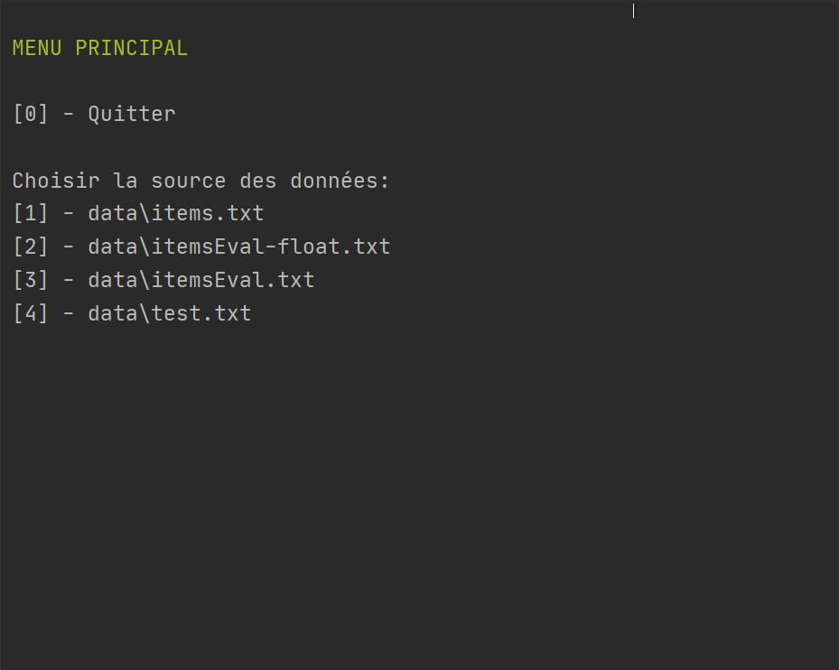

<p align=center>
  
  <h3 align=center>Projet d'algorithmique</h3>

<p align=center style="font-size:5px">
                            ██▓▓▓▓▓▓▓▓▓▓▓▓                              <br>
                          ██▓▓░░        ▓▓▒▒                            <br>
                          ▒▒░░          ▒▒░░                            <br>
                      ▒▒▒▒▒▒▒▒▒▒▒▒▒▒▒▒▒▒▒▒▒▒▒▒▒▒▒▒░░                    <br>
                  ░░▒▒▒▒▓▓▒▒░░░░░░░░░░░░░░░░░░░░░░░░░░                  <br>
                  ▒▒▒▒▒▒▓▓▒▒░░░░░░░░░░░░░░░░░░░░░░░░░░                  <br>
                  ▒▒▒▒▒▒▓▓▒▒░░░░░░░░░░░░░░░░░░░░░░░░░░                  <br>
      ░░          ▒▒▒▒▓▓▓▓▓▓░░░░░░░░░░░░░░░░░░░░░░▒▒░░            ░░    <br>
  ░░░░░░░░    ░░  ▓▓▒▒▓▓██▓▓▒▒▒▒▒▒▒▒░░▒▒▒▒░░▒▒▒▒▒▒▒▒▒▒░░    ░░░░  ░░  ░░<br>
      ░░  ░░  ░░  ▓▓▒▒▓▓▓▓▓▓░░▒▒░░▒▒░░▒▒░░▒▒░░░░░░▒▒░░      ░░    ░░░░  <br>
    ░░░░  ░░  ░░  ▓▓▒▒▓▓▓▓▓▓░░▓▓▒▒▒▒▒▒▓▓▒▒▒▒▒▒▒▒░░▓▓▒▒    ░░░░    ░░░░  <br>
  ░░  ░░  ░░  ░░░░▓▓▒▒▓▓▒▒▓▓▒▒▒▒▓▓▒▒▒▒▓▓▒▒▒▒▓▓▓▓▒▒▓▓▓▓▒▒░░    ░░  ░░  ░░<br>
                  ▒▒▒▒▒▒▓▓▒▒░░▒▒▒▒░░░░░░░░░░░░░░░░░░░░░░                <br>
                  ▒▒▒▒▒▒▓▓▒▒░░▒▒▒▒░░▓▓▓▓░░░░░░░░░░░░░░░░                <br>
                  ▒▒▒▒▒▒▒▒▒▒░░▒▒▒▒░░░░░░░░░░░░░░░░░░░░░░                <br>
                  ▒▒▒▒▒▒▒▒▒▒░░▒▒▒▒░░░░░░░░░░░░░░░░░░░░░░                <br>
                  ▒▒▒▒▒▒▒▒▒▒░░▒▒▒▒▒▒▒▒▒▒▒▒▒▒▒▒▒▒▒▒▒▒▒▒▒▒                <br>
                    ▒▒▒▒▒▒▒▒░░▒▒▒▒▒▒▒▒▒▒▒▒▒▒▒▒▒▒▒▒▒▒▒▒                  
</p>

  <h1 align=center>Problème du sac à dos</h1>
  <br>
<p align="center">
  <a href="#contact">Doumèche Jules</a>
  &nbsp;&nbsp;&nbsp;|&nbsp;&nbsp;&nbsp;
  <a href="#contact">Martin Gwénolé</a>
</p>
<p align="center">
  <a href="#installation">Installation</a>
  &nbsp;&nbsp;&nbsp;|&nbsp;&nbsp;&nbsp;
  <a href="#utilisation">Utilisation</a>
  &nbsp;&nbsp;&nbsp;|&nbsp;&nbsp;&nbsp;
  <a href="#documentation">Documentation</a>
  &nbsp;&nbsp;&nbsp;|&nbsp;&nbsp;&nbsp;
  <a href="#contact">Contact</a>
</p>

<p align="center">

</a>
</p>


## Installation

```sh
# clone du repos
$ git clone https://github.com/julio4/sac-a-dos.git

# se placer dans le répertoire sac-a-dos
$ cd sac-a-dos

# lancer le programme
$ java -jar sac-a-dos.jar [arguments]
```


[](https://console.cloud.google.com/cloudshell/open?git_repo=https://github.com/julio4/sac-a-dos.git)

## Utilisation

```sh
$ java -jar sac-a-dos.jar [chemin] [poidsMax] [Méthode]

  chemin                le chemin du fichier absolu,
                        ou relatif dans le répertoire courant ou dans 'data/'

  poidsMax              Le poids maximal du sac à dos

  Méthode               Méthode utilisée lors de la résolution:
                        -'g','glouton','gloutonne': Algorithme Glouton
                        -'d','dyn','dynamique': Algorithme Dynamique
                        -'p','ps','pse': Algorithme PSE
```

Pour lancer l'interface avec menu:
```sh
$ java -jar sac-a-dos.jar
```
La liste des différentes listes d'objets se situe : ```data/*.txt```

Directement avec des arguments, exemples:
```sh
$ java -jar sac-a-dos.jar itemsEval.txt 20 glouton

$ java -jar sac-a-dos.jar itemsEval-float.txt 15.55 dynamique

$ java -jar sac-a-dos.jar items.txt 5 pse
```

## Documentation

**La documentation JavaDoc : [```/doc```](doc/index.html)**

### Le problèmes du sac à dos

Le [problème du sac à dos](https://fr.wikipedia.org/wiki/Probl%C3%A8me_du_sac_%C3%A0_dos), ou [Knapsack problem](https://en.wikipedia.org/wiki/Knapsack_problem) en anglais, est un problème d'algorithmique.
Ce problème modélise un sac à dos, qui peut contenir des objets jusqu'à un poids limite (le poids maximal du sac). 

Avec un ensemble A d'objets ayant chacun un poids et une valeur, quel est le sous ensemble de A dont tout ses objets peuvent être mis dans le sac sans dépasser son poids maximal, tout en maximisant la valeur totale du sac.
C'est un problème d'optimisation combinatoire

### Les algorithmes implantés

Il existe de nombreux algorithmes différents pour résoudre ce problème.
Cependant nous pouvons les classer dans deux catégories:

- **Résolution approchée** : trouve une solution réalisable qui est proche de la solution optimale. Elle permet souvent d'obtenir une complexité plus intéressante que la solution exacte

- **Résolution exacte** : trouve une solution optimale. L'enjeu est alors de réduire au maximum la complexité d'un tel algorithme

#### - Algorithme Gloutons

L’algorithme calcule pour chaque objet de l'ensemble A le rapport de sa valeur sur son poids.

Puis les objets sont triés dans une liste par ordre décroissant de la valeur du rapport du chaque objet.

Enfin, les objets sont ajoutés un à un dans le sac tant qu’il reste de la place et que le poids maximal n'est pas atteint. Il permet d'obtenir une solution approchée

#### - Algorithme par Programmation Dynamique

Cet algorithme divise le problème en sous problèmes, pour ensuite déduire la solution 'générale'.

L’algorithme crée une matrice de taille ```Poids Max * Nombre d’Objets```. 
Les valeurs décimales sont multipliées par 2 pour pouvoir les représenter comme des Integers (la précision peut être modifiée dans ```Appli.PRECISION```).

L’algorithme rempli en premier la première ligne, puis toutes les lignes de la matrice qui représente le bénéfice possible associé aux i objets avec un poids j.

Puis l’algorithme récupère chaque objet en remontant la matrice pour obtenir la solution optimale.

Exemple:
``` 
> fr.main.Appli itemsEval.txt 20 dyn
Arguments:
Chemin: data/itemsEval.txt
Poids max: 20.0
Méthode: DYNAMIQUE

  i\j  0      1      2      3      4      5      6      7      8      9      10     11     12     13     14     15     16     17     18     19     20     
----------------------------------------------------------------------------------------------------------------------------------------------------------
       0      0      0      0      0      0      0      0      0      0      20     20     20     20     20     20     20     20     20     20     20     
       0      2      2      2      2      2      2      2      2      2      20     22     22     22     22     22     22     22     22     22     22     
       0      24     26     26     26     26     26     26     26     26     26     44     46     46     46     46     46     46     46     46     46     
       0      24     80     104    106    106    106    106    106    106    106    106    106    124    126    126    126    126    126    126    126    
       0      24     80     104    106    115    139    141    141    141    141    141    141    141    141    141    159    161    161    161    161    
       0      24     80     104    106    115    140    164    166    175    199    201    201    201    201    201    201    201    201    201    219    
       0      40     80     120    144    146    155    180    204    206    215    239    241    241    241    241    241    241    241    241    241    
       0      50     90     130    170    194    196    205    230    254    256    265    289    291    291    291    291    291    291    291    291    
       0      50     200    250    290    330    370    394    396    405    430    454    456    465    489    491    491    491    491    491    491    
       0      50     200    250    290    330    370    394    397    405    430    454    457    465    489    492    494    494    494    494    494    
       0      50     200    250    290    330    370    394    397    405    430    454    457    465    489    492    494    494    497    505    530    
       0      50     200    250    290    330    370    394    397    405    1000   1050   1200   1250   1290   1330   1370   1394   1397   1405   1430   

Sac à dos
-Valeur totale: 1430.0
-Poids total: 20.0 (100.00%)
-Poids Maximal: 20.0
-Objets:
  >Lingot d'or [poids= 10.0, prix= 1000.0]
  >iPhone [poids= 2.0, prix= 200.0]
  >Couteau suisse [poids= 1.0, prix= 50.0]
  >Camping gaz [poids= 1.0, prix= 40.0]
  >Sac de couchage [poids= 4.0, prix= 60.0]
  >Chaussures [poids= 2.0, prix= 80.0]
```

#### - Algorithme par Séparation et évaluation (PSE)

L'algorithme crée un [Arbre Binaire de recherche](https://fr.wikipedia.org/wiki/Arbre_binaire_de_recherche) qui énumère toutes les solutions possibles.

Afin de réduire au maximum l'arbre, l'algorithme calcule si une partie de l'arbre peut mener à une meilleure solution que celle(s) déjà trouvée(s) pour éviter d'explorer des branches inutilement.

Avec le meilleur chemin de branches trouvé, l'algorithme retrouve tous les objets de la solution optimale.


### Construire les sources

Dans votre IDE, cloner le repos:
```sh
git clone https://github.com/julio4/sac-a-dos.git
```
Les sources se situent dans ```/src```

#### Utilisation de base

La classe GestionAppli permet de gérer les I/O, et la valiation des arguments.

Dans le main:
```java
//Création de la classe d'aide
GestionAppli app = new GestionAppli();

//Validation des Arguments
app.start(args);

//Création d'un sac à dos
SacADos sac = null;
try {
    sac = new SacADos(CHEMIN, POIDS_MAX);
} catch (IOException e) {
    app.affErreur(e);
    System.exit(1);
}

//Résolution
sac.resoudre(METHODE);

//Résultat
app.afficher(sac);
```


#### Arborescence

<p align="center">

</a>


## Contact

Jules Doumèche - [@julio4](https://github.com/julio4) - jules.doumeche@etu.parisdescartes.fr
Gwénolé Martin - [@LightBowFire](https://github.com/LightBowFire/) - gwenole.martin@etu.parisdescartes.fr

MIT ©<br/>
